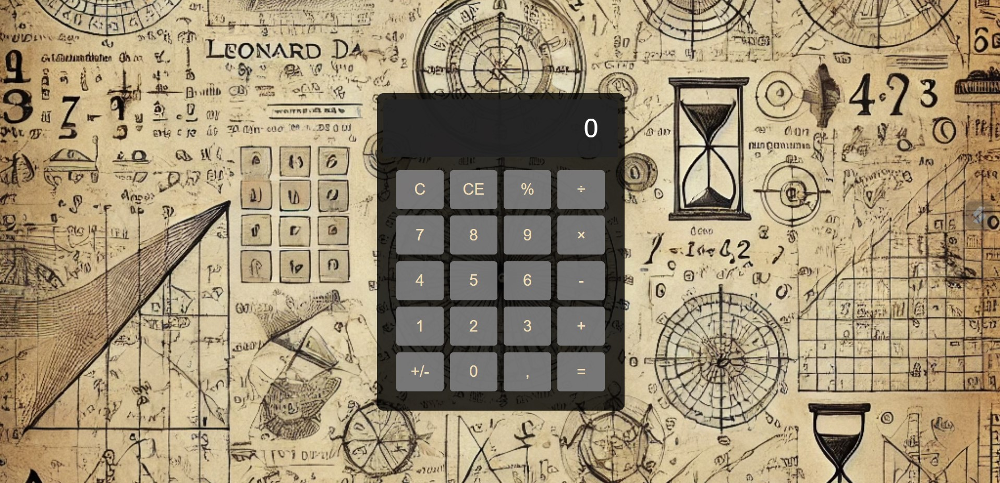

# 🧮 Calculatrice 🧮

 

## 📜 Présentation

Bienvenue dans le projet Calculatrice ! Cette calculatrice web élégante et interactive est conçue pour offrir une expérience utilisateur fluide et intuitive, tout en intégrant des fonctionnalités avancées pour répondre à tous vos besoins de calcul quotidien.   

 
 

## ✨ Fonctionnalités Principales

🔢 Affichage dynamique : Voir en temps réel les opérations et les résultats   
➕➖✖️➗ Support des opérations de base : Addition, Soustraction, Multiplication, Division   
📊 Fonctions supplémentaires : Pourcentage, changement de signe, et décimale   
🧹 Effacement intelligent : Réinitialisation complète ou effacement de la dernière entrée   
💻 Interface utilisateur moderne : Design épuré et responsive, adapté à tous les appareils   

 
 

## 📸 Aperçu

Voici à quoi ressemble l'application :   

[Démo vidéo du projet sur ordinateur 🎥](https://www.youtube.com/watch?v=o9CgNXR_cko)

[Démo vidéo du projet sur mobile 🎥](https://www.youtube.com/watch?v=hovAAe8tGeU)

 
 

## 🌐 Lien direct

Pour l'utiliser : [Calculatrice 🧮](https://gabriellepagnard.github.io/Calculatrice/)   

 
 

## 🔧 Technologies Utilisées

- HTML 🏗️    
- CSS 🎨   
- JavaScript ⚙️   

 
 

## 📂 Fichiers du Projet

- index.html : Le fichier principal qui contient la structure HTML   
- style.css : La feuille de style pour l’apparence   
- app.js : Le script JavaScript qui gère la logique de calcul    
- ressources/ : Contient les images et icônes utilisées dans le projet   

 
 

## 🛠️ Installation et Utilisation

Pour démarrer avec Calculatrice, suivez ces étapes simples :   

➡️ Clonez le Répertoire :   

`git clone https://github.com/votre-utilisateur/calculatrice.git`   

➡️ Accédez au Répertoire :   

`cd calculatrice`   

➡️ Ouvrez le Fichier "index.html" dans votre navigateur pour voir l'application en action   

➡️ Personnalisez le Code selon vos besoins ou apportez des contributions !   

 
 

## 🏗️ Comment Contribuer

Vous souhaitez contribuer ? 🎉 Voici comment faire :   

### Créer une Branche 🌿

➡️ Pour chaque nouvelle fonctionnalité ou correction, créez une nouvelle branche :   

`git checkout -b nom-de-la-branche`   

### Faire vos Changements ✏️   

Apportez les modifications nécessaires et committez-les :   

`git add .`   
`git commit -m "Description des changements"`   

### Pousser les Changements ⬆️   

Envoyez vos modifications à GitHub 📨 :

`git push origin nom-de-la-branche`   

### Créer une Pull Request 🔄   

Allez sur GitHub, ouvrez une Pull Request et expliquez vos modifications   

 
 

## 🤝 Contributeurs/trices

Gabrielle Pagnard 🧑‍💻 - Créatrice du projet

 
 

## 📧 Contact

Pour toute question ou suggestion, n'hésitez pas à me contacter :   

Email : gpagnard@gmail.com   
GitHub : [GabriellePagnard](https://github.com/GabriellePagnard)     

 
 
 

Merci d'avoir visité le projet Calculatrice ! 🚀   

J'espère qu'il vous sera utile et agréable à utiliser. N'hésitez pas à laisser un ⭐ si vous aimez ce projet !   
